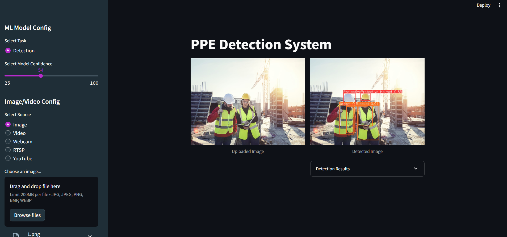
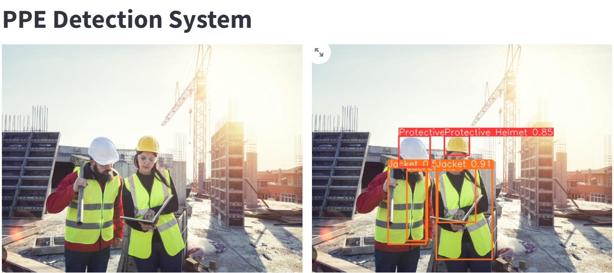
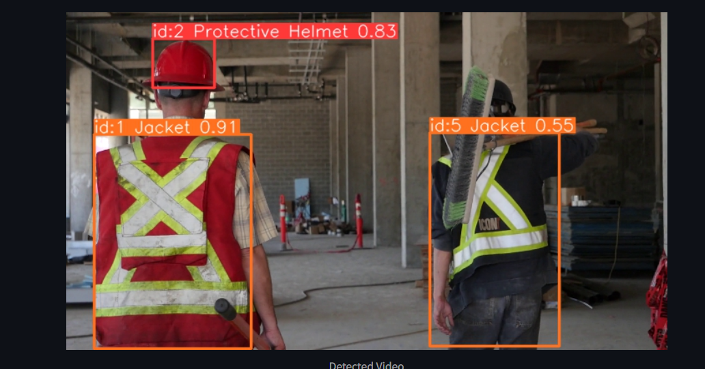

# PPE detection for workers with YOLOv8 and Streamlit

A deep learning-based project to enhance workplace safety by detecting Personal Protective Equipment (PPE) like helmets, vests, masks, and gloves in real-time. Built using Python, OpenCV, and YOLO for accurate object detection. This system ensures compliance, generates alerts for non-compliance, and supports customization for various industries.

## Demo WebApp
(https://rajdevx.github.io/ PPE-dection-using-yolov8/)
This app is up and running on Streamlit cloud server!!! Thanks 'Streamlit' for the community support for the cloud upload. You can check the demo of this web application on the link below.

## Result

## Requirements

Python 
YOLOv8
Streamlit

